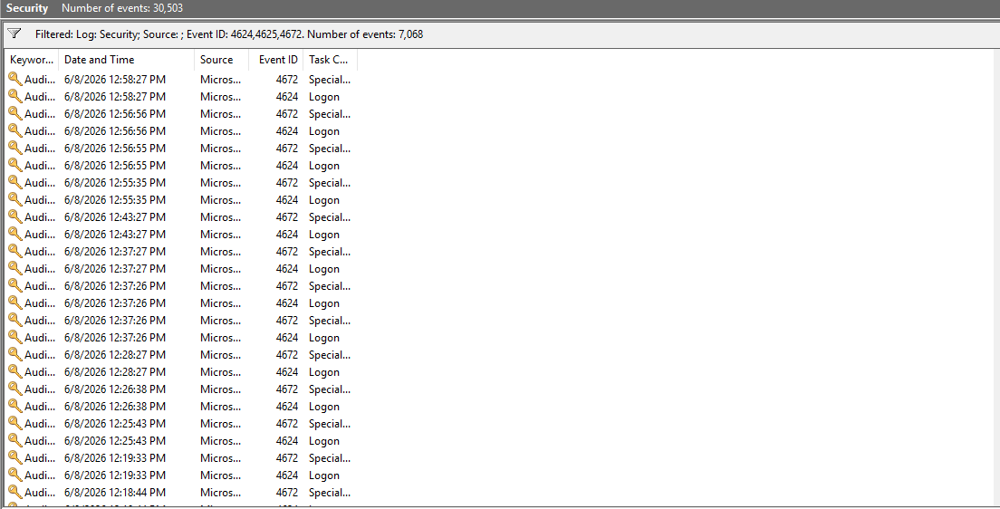
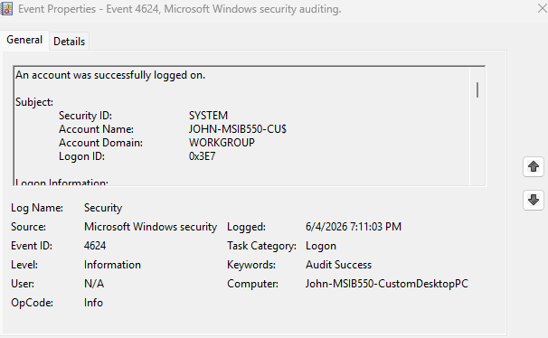
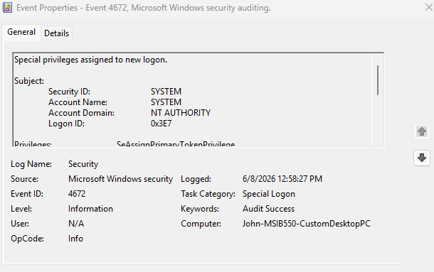

# Windows Event Log Investigation

## Objective

Analyze Windows Security Event Logs to identify successful logons, privileged logon activity, and security-relevant authentication events.

## Tools Used

- Windows Event Viewer
- Windows Security Logs
- Windows 11

## Event IDs Investigated

| Event ID | Description |
|---------|-------------|
| 4624 | Successful logon |
| 4625 | Failed logon |
| 4672 | Special privileges assigned to new logon |

## Investigation Steps

1. Opened Windows Event Viewer.
2. Navigated to Windows Logs > Security.
3. Filtered the Security log for Event IDs 4624, 4625, and 4672.
4. Reviewed successful logon events.
5. Reviewed privileged logon events.
6. Documented findings and security relevance.

## Findings

### Event ID 4624 - Successful Logon

Event ID 4624 was observed in the Windows Security log. This event indicates that an account successfully logged on to the system.

Successful logon events are important because they help analysts verify user activity, identify access patterns, and investigate suspicious authentication behavior.

### Event ID 4672 - Special Privileges Assigned

Event ID 4672 was observed in the Windows Security log. This event indicates that special privileges were assigned to a new logon session.

The event included the SYSTEM account, which is commonly associated with normal Windows system processes and administrative activity.

### Event ID 4625 - Failed Logon

The Security log was filtered for failed logon events using Event ID 4625. No failed logon events were observed in the visible filtered results.

## Security Relevance

Windows Security logs are important for detecting and investigating authentication activity. Security analysts use these logs to identify successful logons, failed logon attempts, privileged access, and potentially suspicious user behavior.

Monitoring Event IDs 4624, 4625, and 4672 can help support incident response, account monitoring, and threat investigation.

## Skills Demonstrated

- Windows Event Viewer
- Security Log Analysis
- Authentication Event Investigation
- Privileged Logon Review
- SOC Analyst Fundamentals
- Incident Response Documentation

## Screenshots

### Filtered Security Events

### Successful Logon Event

### Privileged Logon Event

